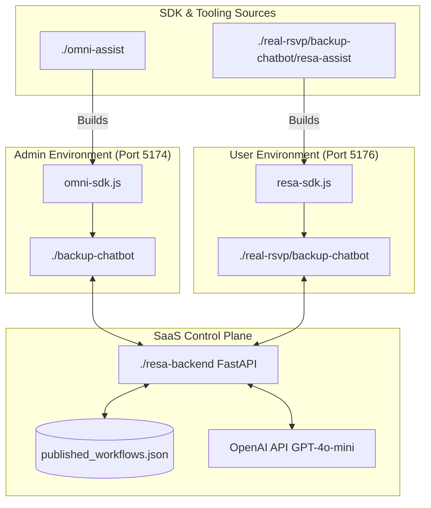

# Omni Assist & Resa Assist Project Instructions

This project consists of two main UI environments and two SDK source projects, coordinated via a shared backend.

## 1. Project Architecture

| Component | Source Path | Host Port | Purpose | Embedded SDK |
|-----------|-------------|-----------|---------|--------------|
| **Admin UI** | `./backup-chatbot` | `5174` | Product for Admin (Client side) | `omni-sdk.js` |
| **User UI** | `./real-rsvp/backup-chatbot` | `5176` | Product for User (Client side) | `resa-sdk.js` |
| **Omni SDK Source** | `./omni-assist` | - | Logic for Admin's Recording & Studio | - |
| **Resa SDK Source** | `./real-rsvp/backup-chatbot/resa-assist` | - | Logic for User's Chatbot & Automation | - |
| **Resa Backend** | `./resa-backend` | `6789` | API for Published Workflows & GPT Chat | - |



---

## 2. Development Commands (Live Reload)

Run these commands in separate terminals to start the development environments:

- **Admin UI (Port 5174)**:
  ```bash
  cd backup-chatbot && npm run dev
  ```
- **Admin SDK Logic (Studio)**:
  ```bash
  cd omni-assist && npm run dev
  ```
- **User UI (Port 5176)**:
  ```bash
  cd real-rsvp/backup-chatbot && npm run dev -- --port 5176
  ```
- **Backend API (Port 6789)**:
  ```bash
  cd resa-backend && python3 main.py
  ```

---

## 3. Build & Deployment Commands (Production Sync)

Whenever you modify the logic in the SDK source folders, you must build and copy them to the public directories of the host applications.

### A. Deploying to Admin (Studio/Omni)
Run from `./omni-assist`:
```bash
npm run build && cp -f dist/omni-sdk.umd.cjs ../backup-chatbot/public/omni-sdk.js
```

### B. Deploying to User (Chatbot/Resa)
Run from `./real-rsvp/backup-chatbot/resa-assist`:
```bash
npm run build && cp -f dist/resa-sdk.umd.cjs ../public/resa-sdk.js
```

---

## 4. Key Logic Files
If you need to update the perception engine or automation logic:
- `src/perception.ts`: Core element matching and recording logic.
- `src/guide.ts`: Action execution and value setting logic.
- `src/workflow-engine.ts`: Multi-step orchestration logic.
