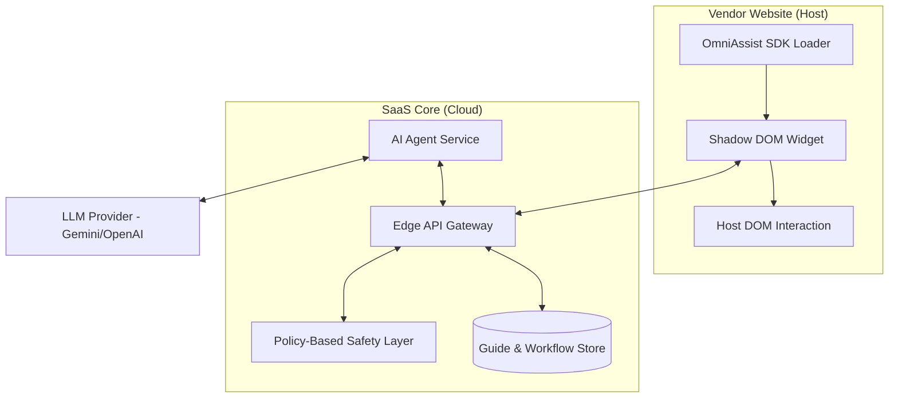

# OmniAssist: Website-Agnostic SaaS Assistant

OmniAssist is a next-generation SaaS platform designed to be seamlessly integrated into any vendor website. It serves two primary functions:
1. **Intelligent Guidance**: Providing step-by-step interactive walkthroughs for users.
2. **Autonomous Actions**: Performing tasks such as filling forms, selecting options, and clicking elements on behalf of the user.

---

## ✨ Premium UX & Aesthetics

OmniAssist is built with a **Design-First** philosophy to ensure it feels like a native, premium part of any host website.

- **Glassmorphism UI**: The assistant widget utilizes a sleek, translucent backdrop with subtle borders, blending perfectly with modern web designs.
- **Dynamic Micro-Animations**: Smooth transitions between guide steps, pulse effects for highlighted elements, and magnetic hover states for buttons.
- **Adaptive Dark Mode**: Automatically detects the host website's theme and adjusts its palette (e.g., Deep Oceanic Blues for dark themes, Soft Slate for light themes).
- **Non-Intrusive Presence**: Minimized "Floating Action Button" (FAB) style that expands into a focused assistant only when needed.

---

## 🏗️ System Architecture

OmniAssist uses a distributed micro-services architecture with a focus on **zero-collision client integration**.

---

## 🛠️ Core Components

### 1. Frontend SDK & Shadow DOM
To ensure the assistant works on any website (including complex SPAs like the demo sites), we utilize:
- **Shadow DOM Isolation**: The entire UI is rendered inside a Shadow Root. This prevents the vendor's CSS from leaking into the assistant and vice versa.
- **Micro-Frontend Bundle**: A lightweight (<50kb) JS bundle that initializes once the host DOM is ready.
- **MutationObserver**: Monitors the host DOM for dynamic changes, ensuring the assistant can interact with late-loading elements (common in React/Next.js).

### 2. Semantic Action Engine (Agnostic Perception)
Instead of relying on fragile CSS selectors (which may change during site updates), OmniAssist uses a **Semantic Mapping Layer**:
- **Accessibility Tree Mapping**: Analyzes ARIA roles, labels, and text content to build a "Mental Model" of the page.
- **Proximity Analysis**: Identifies relationship between elements (e.g., pairing a "First Name" label with the adjacent input field).
- **Visual Anchoring**: Uses stable visual landmarks on the page to maintain positioning even when the DOM is reorganized.

### 3. Policy-Based Safety Layer (Action Safety)
To prevent accidental or harmful autonomous actions, OmniAssist implements a strict policy engine:

| Action Risk | Examples | Execution Mode |
| :--- | :--- | :--- |
| **Low-Risk** | Navigation, searching, filling text fields (draft), highlighting elements. | **Autonomous** (Automatic) |
| **High-Risk** | Delete, Approve, Send, Submit Payment, Final Form Submission. | **Human Confirmation Required** |

> [!IMPORTANT]
> **Safety Hook**: High-risk actions trigger a confirmation modal within the Shadow DOM that the user must explicitly click before the engine executes the underlying `click()` or `submit()` event.

### 4. Hybrid Guide Creation
- **MVP (Manual Recording)**: Vendors use a "Developer Mode" to record actions on their own site. These recordings are saved as structured JSON workflows.
- **Phase 2 (AI Generation)**: AI analyzes the page structure and generates draft guides based on goals like *"How do I change my password?"*. Vendors review, edit, and publish these drafts.

---

## 🚀 Integration Demo Scenarios

Based on the provided demo sites, here is how OmniAssist would operate:

### 1. [Request Management Dashboard](https://backup-chatbot-9n0j46od4-toduyhungs-projects.vercel.app/requests)
- **Guide**: Show users how to filter and approve incoming data requests.
- **Action**: Auto-populate search filters and highlight high-priority "Pending" requests for immediate review.

### 2. [Analytics Dashboard](https://stai-dashboard.vercel.app/)
- **Guide**: Step-by-step walkthrough of the data tabs.
- **Action**: Switch between tabs (Low-risk) and highlight the "Export" button for the user.

### 3. [Smart Office Login](https://js-ocs-smart-office-iirk.vercel.app/login)
- **Guide**: Assist new employees in logging in for the first time.
- **Action**: Detect unsuccessful login attempts and offer a guide to "Reset Password."

---

## 🔒 Security & Performance
- **Zero-Trust Communication**: All requests between the SDK and API are signed with a unique Tenant-ID and Origin-Validation.
- **CORS & CSP**: Scripts are served from a global CDN with pre-configured headers to bypass strict Content Security Policies on vendor sites.
- **Analytics**: Real-time tracking of guide completion rates and "Human Intervention" events on high-risk actions.
