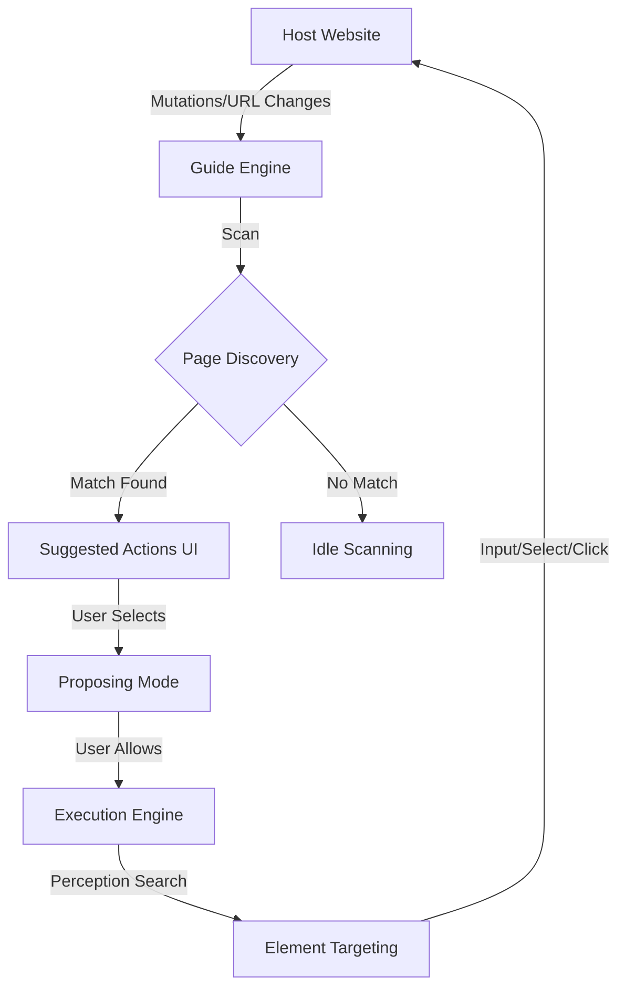

# OmniAssist Agentic Navigation (v4.6.32)

OmniAssist is a powerful, website-agnostic autonomous navigator designed to provide interactive guidance and automated form-filling on complex enterprise web applications (SPA). It leverages a custom perception engine and a schema-driven state machine to bridge the gap between user intent and browser interaction.

## 🚀 Version Highlights (v4.6.25 - v4.6.32)

The `v4.6.32` release focuses on **Precision, Depth, and Resilience**, specifically addressing the challenges of Material UI (MUI) frameworks and Single Page Application (SPA) state synchronization.

### 🧠 Core Innovations

*   **Deep Form Awareness (v4.6.31)**: Automatically resolves UI 'Labels' to their nested 'Input' fields. This allows schemas to target human-readable labels while performing automated actions on the actual form controls.
*   **Visual Snap Highlighting (v4.6.32)**: The perception engine now 'snaps' to the logical container (e.g., `.MuiTextField-root`) for highlighting. This ensures visual focus covers the entire interactive box instead of just text or sub-spans.
*   **Strict Page Discovery (v4.6.28)**: Enforces schema-first matching with path length priority. This eliminates 'Stale Actions' (e.g., Dashboard guides leaking into Wizard pages).
*   **Ref-Based State Sync (v4.6.29)**: Uses React Refs to decouple discovery logic from the JS closure trap, ensuring 100% reliable suggested action updates during async SPA transitions.
*   **Guarded Navigation Fallback (v4.6.26)**: A robust fail-safe that forces route changes if native click events fail to trigger a destination update within a defined timeout.

## 🛠 Technology Stack

*   **Core**: TypeScript, React, Vite.
*   **Perception**: Custom heuristic engine with case-insensitive matching and DOM depth prioritization.
*   **Isolation**: Shadow DOM injection to prevent styling leakage between host site and assistant.
*   **Stability**: MutationObserver-driven discovery and History API patching for SPA route awareness.

## 📐 Architecture Overview



### Key Modules

- `src/perception.ts`: The "Eyes" of the bot. Handles element scoring, depth-search, and container resolution.
- `src/guide.ts`: The "Brain". Manages task lifecycle, automated step execution, and navigation guards.
- `src/App.tsx`: The "Interface". Handles the React component lifecycle, refs for async sync, and UI rendering.
- `src/schema.ts`: The "Knowledge Base". Defines rules, pages, and interactive steps for the target site.

## 🧪 Development & Deployment

### Local Development
```bash
# In omni-assist directory
npm install
npm run dev
```

### Production Build
```bash
# Generates omni-sdk.umd.cjs for host injection
npm run build
cp dist/omni-sdk.umd.cjs ../host-app/public/omni-sdk.js
```

## 📋 Recommended Next Steps (For Tomorrow)

1.  **Contextual Validation**: Further refine the `perception.ts` scores for complex nested tables.
2.  **Schema Expansion**: Add the "LOB" and "Business Area" specific logic to the `InteractionTypes`.
3.  **Visual Polish**: Enhance the `omni-shimmer-text` visibility for longer scanning periods.

---
*Created and maintained by Antigravity AI @ 2026-04-20*
